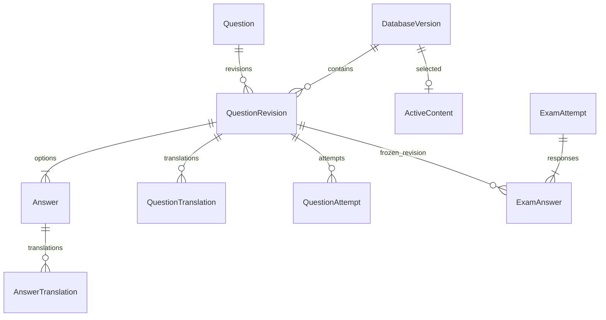

# Архитектура — сохранена из этапа 1

| Модуль | Ответственность |
|---|---|
| :core:domain | Чистые Kotlin-модели, языковая политика, валидация пакетов, контракты репозиториев, структура экзамена |
| :core:data | Room, DataStore, импорт, локальные репозитории, начальная загрузка |
| :core:designsystem | Material 3, типографика, цвета |
| :app | Навигация, MainViewModel, экраны, CS/RU/UK-ресурсы, AppContainer |

MVVM: Compose → MainViewModel → репозитории → Room/DataStore. StateFlow, lifecycle-aware collection, Navigation Compose. Ручное внедрение зависимостей для компактного каркаса. API 26+, compile/target 35; требования Google Play проверяются отдельно перед будущей публикацией.

## Версии

Room schema version=1; databaseVersion — версия пакета контента; publicationDate — официальная дата публикации; importDate — время импорта на устройстве; formatVersion — версия транспортного контракта. Дата получения не заменяет официальную дату. Старые редакции сохраняются, активная определяется ActiveContent(slot=1).

## 29 таблиц

| Группа | Таблицы |
|---|---|
| Версии | DatabaseVersion, ActiveContent |
| Категории | QuestionCategory, QuestionCategoryTranslation |
| Оригиналы | Question, QuestionRevision, QuestionLicenceGroup, Answer, QuestionMedia |
| Переводы | QuestionTranslation, AnswerTranslation |
| Знаки | TrafficSign, TrafficSignTranslation |
| Уроки | Lesson, LessonTranslation, LessonBlock, LessonBlockTranslation, LessonQuestion |
| Словарь | DictionaryWord, DictionaryForm, DictionaryTranslation |
| Личные данные | SavedWord, WordReview, FavoriteQuestion |
| Подготовка | QuestionAttempt, QuestionReview, LearningProgress |
| Экзамен | ExamAttempt, ExamAnswer |

Каждая сущность в отдельном Kotlin-файле. Составные ключи и внешние связи заданы в Room. `schema.sql` — исполняемый проект DDL; реальный JSON Room генерируется KSP в `core/data/schemas`.

UserSettings хранится только в DataStore. Попытки и экзамены привязаны к редакциям вопроса; избранное — к устойчивому ID. Импорт не удаляет прогресс. Нет destructive migration. При изменениях схемы нужны явные Migration и проверки со старым JSON Room.

## Языки и подсказки

CS — оригинал материала. CS/RU/UK — независимо выбираемый язык меню. Материал CS+RU / CS+UK / CS only. Переводы имеют строковый locale, позволяющий добавлять другие языки без новых полей Question.

Начинающий видит перевод; средний открывает его кнопкой; экзаменационный уровень выключает подсказки. CS only и настоящий экзамен имеют приоритет. Нет автоматической подмены отсутствующего UK русским или наоборот. При смене режима старые асинхронные переводы фильтруются по locale.

## Ранее принятые уточнения

- Экзамен должен учитывать семь квот 10/4/3/3/2/2/1, применимость к B и баллы. Пока есть только blueprint; генератор и таймер не включены в этап 1.
- Упрощённое учебное правило не подменяет юридическую цитату или экзаменационный текст. Пример преимущества справа требует точного описания равнозначного перекрёстка и исключений.
- Самооценка причины ошибки не является объективным показателем знания языка. Фиктивные проценты не показываются.
- Усвоение вопроса в будущем: три правильных ответа в разнесённых сессиях. Изменение редакции сбрасывает серию, сохраняя историю. Алгоритм ещё не реализован.
- Для TTS офлайн потребуется установленный чешский голос. Произношение — последующий этап.
- Модель допускает видео и локальное медиа; рендереры ещё не добавлены.

## Дополнение Stage 2

Существующие 29 таблиц Room используются без изменения schema v1. `LearningDao`, `LearningRepository` и `ExamRepository` добавляют сохранение попыток, избранного, ошибок, повторения слов, уроков и незавершённого экзамена. `ExamEngine` и `ReviewPolicy` находятся в domain. Настройки onboarding входят в DataStore.

`app/src/debug` и `core/data/src/debug` содержат developer-функции и sample bootstrap; release содержит пустые точки подключения. Проверка содержимого APK: `tools/verify_apks.py`. Подробное описание актуальных сценариев и ограничений: [STAGE2_SCOPE.md](STAGE2_SCOPE.md).
